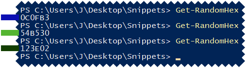
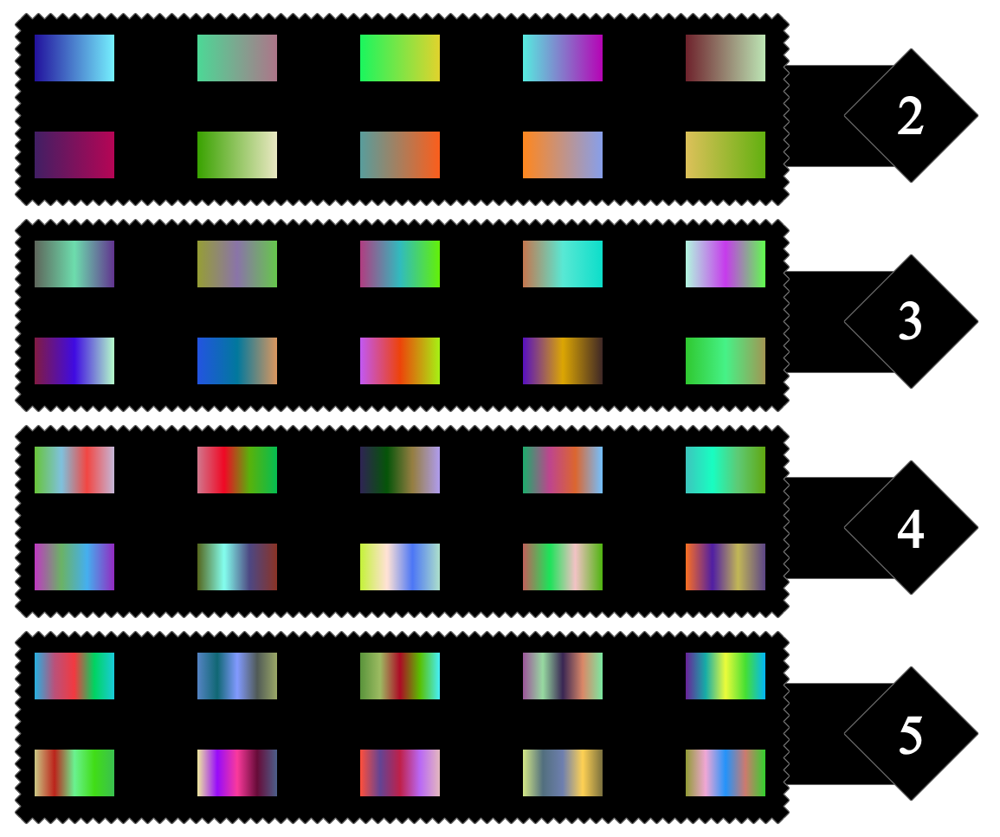
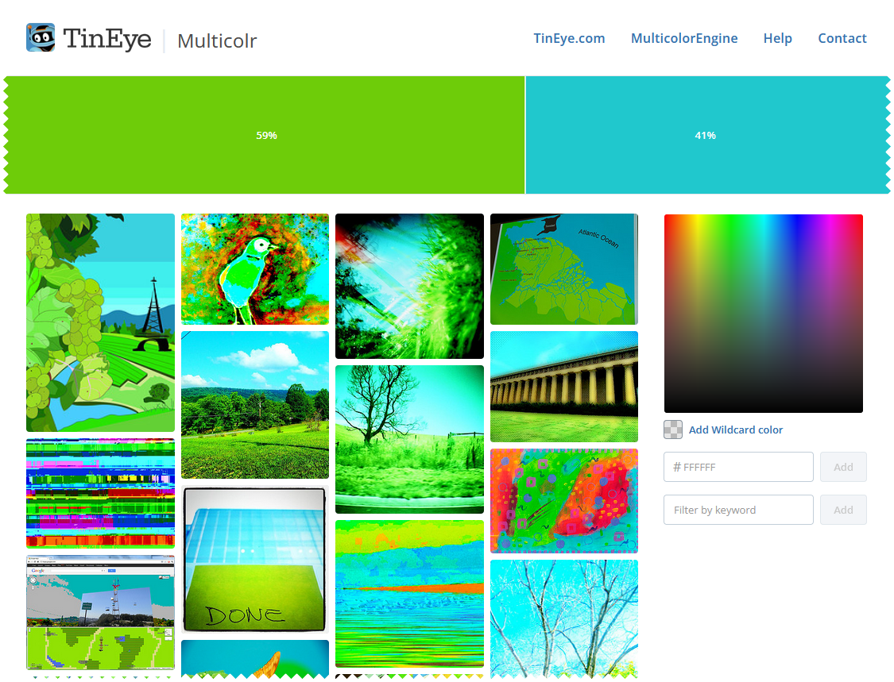

# Powershell Snippets and Scripts

These are some simple scripts I made while learning powershell and experimenting with stuff I can do in powershell, these scripts aren't the most professional and they might not be useful to everyone, but it's mostly for fun.

## Previews

### Get-RandomHex

A very simple script that creates a hex color code.

### Gradient Makers

These scripts create an HTML document that contains 10 gradients ranging from 2 to 5 colors depending on the script.

### Tineye Random Search

Tineye has a feature where you can choose 2 or more colors and it will search for images containing those colors, this script simply picks 2 random colors and random weight values and then opens the tineye URL.

## License

[GPL-3.0](LICENSE)